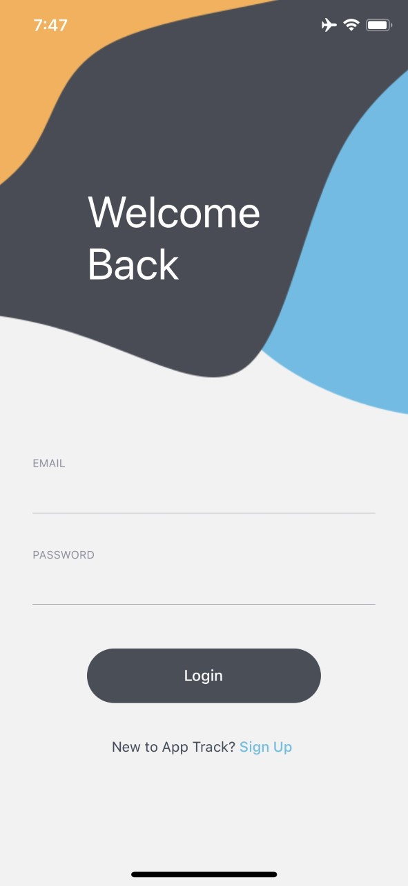
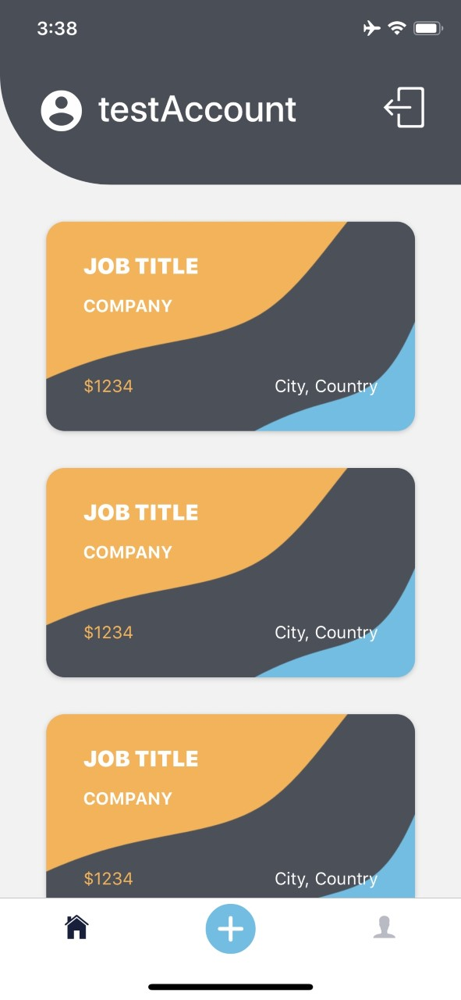
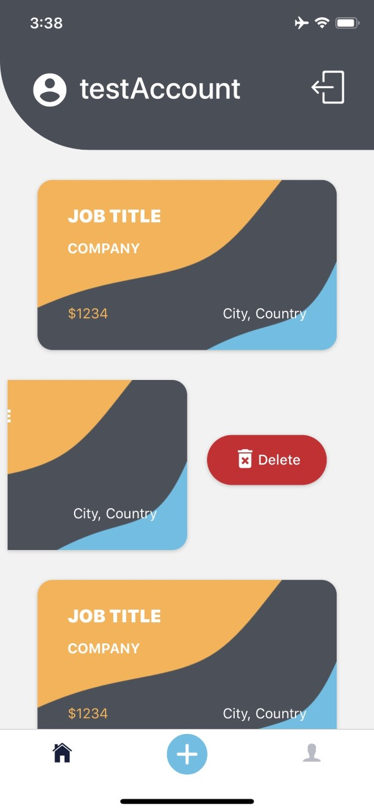

# App Track

> An app for keeping track of job applications.

## What's In This Document

- [General Info](#general-info)
- [Technologies](#technologies)

## General Info

App Track is a native application created to combat clumsy Excel spreadsheets meant for tracking job applications.

Upon app load, users are brought to a login screen where they can also click a link to register an account.

   

After being authenticated via firebase authentication, the user is taken to the home screen and is shown their jobs. If the user does not have any jobs added they will be prompted to do so.

   

The user can delete an individual job by sliding the job card left and clicking the hidden "Delete" button.

  

When the user presses the center button of the navbar they will be taken to a form in a modal that they can add a job with the details they submit.

  

On the Profile screen the user will be shown their email, the date their account was created, and how many jobs they currently have entered. The profile screen also contains two buttons in which the user can delete all of their currently added jobs or deactivate their account. Each button will display an alert when pressed asking the user to confirm their action.

  

## Technologies

App Track is created with:

* CSS
* React-Native
* Redux
* React-Redux Hooks
* Redux-Thunk
* Firebase
* React-Native-Swipe-List-View
* React-Navigation
* React-Navigation-Stack
* React-Navigation-Tabs
